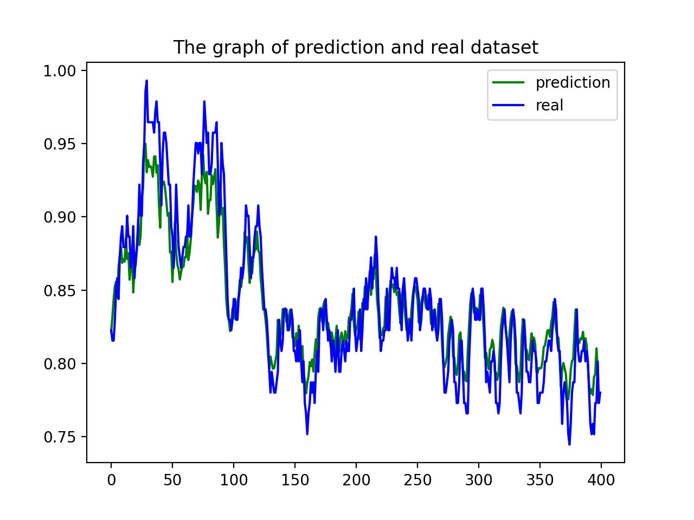
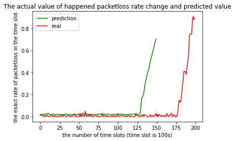

# heart rate simulation system 

## This document introduces a way to build a secure and low-energy consuming system

- This algorthm mainly uses two well-trained lstm network for all data processing
    -   Heart rate is a time-sequential event, and heart rate of the previous 
        minute would highly affect the next minute, so that the DNN with memory
        LSTM would be useful in heart rate regression, which means that the
        prediction of future heart rate would be reliable, and can be treated as 
        valuable data when packet loss occurs, filling the gap.
        

    -   For packet loss simulation, the simulation is basically the simulation 
        of three randomly happening event. The proposed packet loss rate is also 
        well regressed and predicted by the full-trained LSTM 
        (can be predicted in advance)
        
