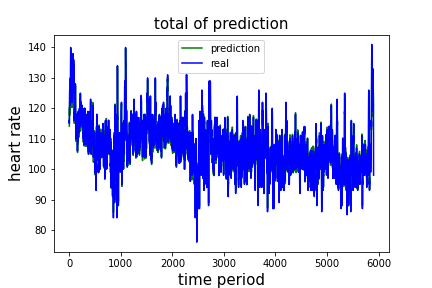
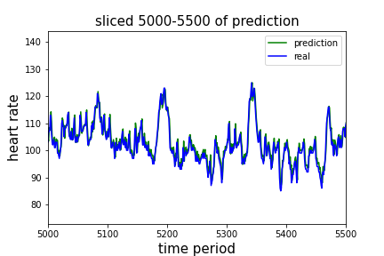

# This is a heart rate packet loss filling

## Basic Introduction
 - The one_day_heartbeat.py is a backup data for the experiment
 - The heartbeat_extraction.py is a algorithm to count heart rate from ECG file.
   So the exact file name and the threshold should be different when different 
   data is used
 - The keras_heartrate_dropout.ipynb is a LSTM approach using keras for heart
   rate analysis and prediction. The prediction is made from **2** previous heart
   rates.

## Result
 - The general result for the heart rate fitting is:
   
 - magnifying one part of 5000 - 5500, a result is shown:
   
 - error calculated by $error = |pred - real| \div real $
   
   
